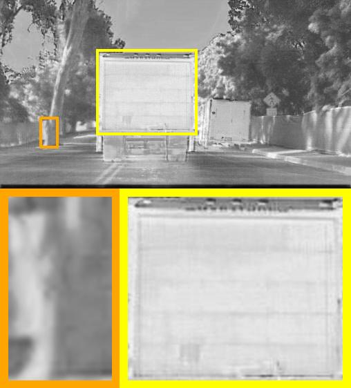
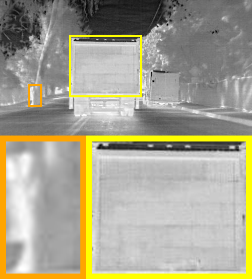
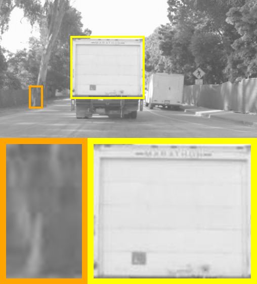

# 图像局部放大脚本

可对图像进行局部放大，并对放大区域绘制矩形框，支持同时处理多张图像、任意放大倍率，并且可以将放大区域放置在图像的任何角落。

<div style="display: flex;">
    
    
    
</div>

## 特点

- **同时处理**: 支持同时处理多张图像。
- **任意放大倍率**: 允许用户选取两块重点区域。
- **不覆盖源图像**: 放大区域在源图像下部，不影响源图像。


## 用法

1. 确保已经安装```python```，```opencv-python```和```PIL```
2. 将需要画框的图像都放入同一文件夹
3. 设置脚本的参数
```
dir_path: (your_image_path)
roi_image: (image_used_draw_RoI)
save_dir: (save_folder)
```
4. 运行 ```python magni_patch.py``` 


